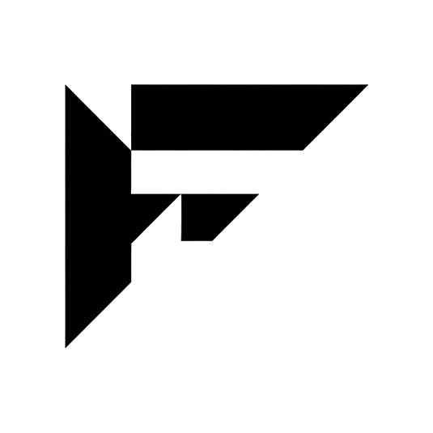

<p align="center">
  
</p>

<h1 align="center">OpenFlagr</h1>

<p align="center">
  Open-source feature flags, A/B testing, and dynamic configuration.
</p>

<p align="center">
  <a href="https://github.com/openflagr/flagr/actions/workflows/ci.yml?query=branch%3Amain+" target="_blank">
    
  </a>
  <a href="https://goreportcard.com/report/github.com/openflagr/flagr" target="_blank">
    
  </a>
  <a href="https://godoc.org/github.com/openflagr/flagr" target="_blank">
    
  </a>
  <a href="https://github.com/openflagr/flagr/releases" target="_blank">
    
  </a>
  <a href="https://codecov.io/gh/openflagr/flagr">
    
  </a>
  <a href="https://deepwiki.com/openflagr/flagr">
    
  </a>
</p>

## What is Flagr?

Flagr is a Go service for feature flags, A/B tests, and dynamic configuration. You call `POST /api/v1/evaluation`, Flagr looks at who is asking, and returns a variant with an optional JSON attachment. One primitive, the flag, powers it all.

Use it to ship code dark and turn it on per audience, run experiments with sticky assignment, or change runtime config without redeploying.

[`openflagr/flagr`](https://github.com/openflagr/flagr) continues development from the original [`checkr/flagr`](https://github.com/checkr/flagr).

## Repos

| Project | Status | Description |
|---------|--------|-------------|
| [flagr](https://github.com/openflagr/flagr) | ✅ Production | Core feature flagging service |
| [goflagr](https://github.com/openflagr/goflagr) | ✅ Maintained | Go client SDK |
| [jsflagr](https://github.com/openflagr/jsflagr) | ✅ Maintained | JavaScript client SDK |
| [terraform-provider-flagr](https://github.com/openflagr/terraform-provider-flagr) | 🧪 Experimental | Terraform provider for managing flags as code |
| [flagr-openfeature-provider-js](https://github.com/openflagr/flagr-openfeature-provider-js) | 🔨 Work in progress | OpenFeature JS provider for Flagr |
| [flagr-next](https://github.com/openflagr/flagr-next) | 🔨 Work in progress | Research into native Next.js integration |

## Quick start

```sh
docker pull ghcr.io/openflagr/flagr
docker run -it -p 18000:18000 ghcr.io/openflagr/flagr

open http://localhost:18000
```

Try it live: [try-flagr.onrender.com](https://try-flagr.onrender.com) (may cold-start)

```sh
curl -sS -X POST https://try-flagr.onrender.com/api/v1/evaluation \
  -H 'content-type: application/json' \
  -d '{
    "entityID": "127",
    "entityType": "user",
    "entityContext": { "state": "NY" },
    "flagID": 1,
    "enableDebug": true
  }'
```

## Contributing

We love contributions. Open an issue or send a pull request.

Have an idea for a new project or feature? [Open an issue](https://github.com/openflagr/.github/issues) here at the org level and let's talk.
